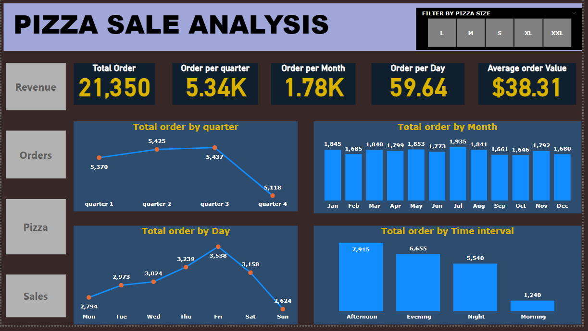
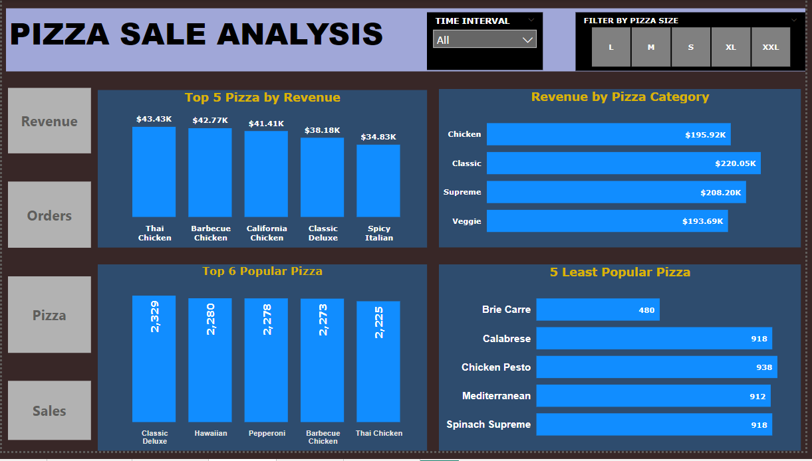
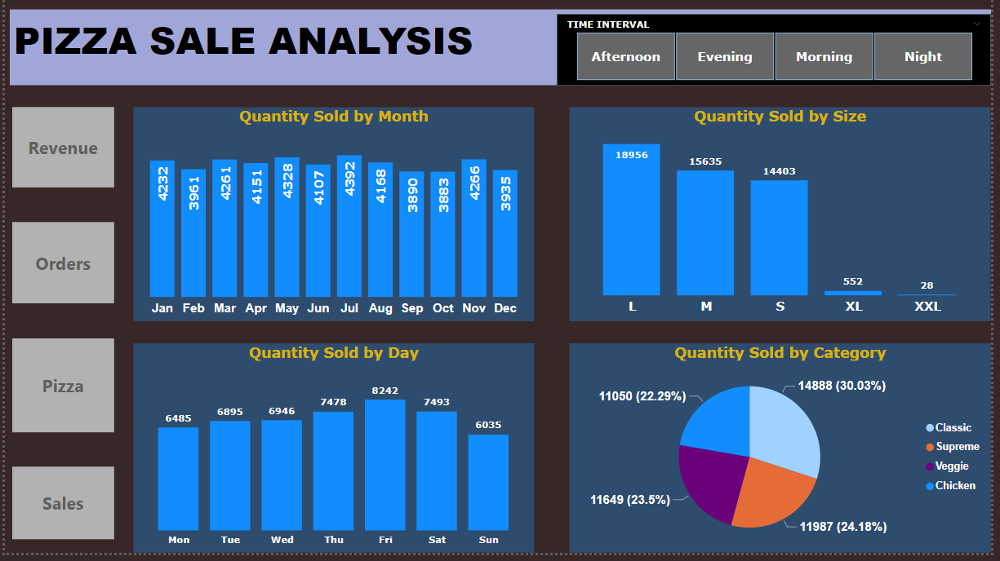

# PIZZA SALE ANALYSIS

## INTRODUCTION
This is a Power BI project on a Pizza Store sales analysis.
The project aims to analyze and derive insight to answer crucial business questions and to help the store make data-driven decisions.

## PROBLEM STATEMENT
The following questions will be answered
1.	What is the total revenue generation and how does it vary quarterly, monthly and daily?
2.	What are the average revenue generations on a quarterly, monthly and daily basis?
3.	What is the total order and how does it vary quarterly, monthly and daily?
4.	What is the most popular and least popular pizza in terms of pizza name, category and size?
5.	How do pizza sales vary across Pizza categories, sizes and time intervals?

## SKILLS AND CONCEPTS INCORPORATED
The following Power BI features were incorporated
- Bookmarks
- DAX
- Quick Measures
- Page Navigation
- Modelling
- Filters
- Buttons

## DATA SOURCING
Data was gotten from Kaggle.com

## DATA TRANSFORMATION
Data was transformed to get additional columns like; 
- Quarter
- Month
- Day
- Time interval

## MODELLING
Relationships were automatically generated 

There are 2-dimensional tables and 2 fact tables, dimension tables are joined to fact tables with one-to-many relationship.
---

## VISUALIZATION
The report comprises 4 pages.
- Revenue
- Order
- Pizza Performance
- Quantity Sold

## ANALYSIS
### REVENUE

The following buttons Revenue, Orders, Pizza and Sales can be used to navigate from one page to the order while the filter button can be used to drill down for more insights. 
---
The total revenue generated for the year is $817,860.05.
The second quarter (from April to June) recorded the highest revenue with $208,369.75 while the fourth quarter (October to December) recorded the lowest revenue with $199,124.10.
July recorded the highest revenue generation with $72,557.90, while October recorded the lowest revenue generation with $64,027.60.
Friday recorded the highest revenue generation of $136,073.90, while Sunday recorded the lowest revenue with $99,203.50.
Average revenue for quarterly, monthly and daily are 5337.50, 1779.17 and 59.64 respectively.
The peak time for revenue generation is the Afternoon  with a total revenue of $330,137.30, and the lowest time for revenue generation is the Morning with a total revenue of $45,322.45.
---
### ORDER

The total order is 21350, average order value is $38.31.
The average order per quarter is 5337.50, the highest order was recorded in the third quarter with 5437 orders and the lowest order was recorded in the fourth quarter with 5118 orders.
The average order per month is 1779.17, the highest order was recorded in July with 1935 orders while the lowest order was recorded in October with 1646 orders.
The average order per day is 59.64, the highest order was recorded On Friday with 3538 orders, while the lowest order was recorded on Sunday with 2624 orders.
The busiest time of the day is the Afternoon between 12 pm - 3.59 pm with a total order of 7915, while the least busy time of the day is the Morning between 9 am – 11:59 am with 1240 orders.
---

### PIZZA PERFORMANCE

The most popular pizza is Classic Deluxe with a total order of 2329.
The least popular pizza is Brie Carre with a total order of 480.
The category that recorded the highest revenue generation is Classic with a total revenue of $220,053.10, while Veggie with a total revenue of $193,690.45 recorded the lowest revenue generation.
Thai Chicken Pizza recorded the highest revenue generation with a total revenue of $43,434.25, while Brie Carre Pizza with a total revenue of $11,588.50 generated the lowest revenue.
Large size recorded the highest revenue ($375,318.70) and  12,736 orders while XXL size recorded the least revenue ($1,006.60) and  28 orders.
---

#### 6 TOP POPULAR PIZZA  ARE:
   Pizza Name             |      Orders
|-------------------------|--------------------|
Classic Deluxe            | 2329
Hawaiian                  | 2280
Pepperoni                 | 2278
Barbecue Chicken          | 2273
Thai Chicken              | 2225
---

#### 5 LEAST POPULAR PIZZA ARE:
   Pizza Name           |       Orders
|-----------------------|------------------|
  Brie Carre            | 480
Mediterranean           | 912
Calabrese               | 918
Spinach Supreme         | 918
Chicken Pesto           | 938
---

#### TOP 5 PIZZA BY REVENUE GENERATION
  Pizza Name               |       Revenue ($)
|--------------------------|----------------------|
  Thai Chicken             | 43,434.25
   Barbecue Chicken        | 42,768
   California Chicken      | 41,409.50
   Classic Deluxe          | 38,280.50
   Spicy Italian           | 34,831.25
   ---
 
### QUANTITY SOLD

The total quantity sold is 49,574.
July recorded the highest quantity sold (4392) while October with to total of 3883 recorded the lowest quantity sold.
 Large size with the total quantity (18956) recorded the highest quantity of sold while XXL size with the total quantity  (28)  recorded the lowest quantity sold.
Pizza has 4 categories namely Classic, Supreme, Veggie and Chicken, Classic category with a total of 14,888 is the highest quantity sold, while Chicken with a total of 11050 recorded the lowest quantity sold.
 Friday recorded the highest quantity sold 8242, while Sunday recorded the lowest quantity sold 6035.
 ---
 
## SUMMARY OF ANALYSIS
The total revenue generated for the year is $817,860.05.
There is an upward trajectory of pizza orders and revenue from quarter 1 to quarter 3 and a sudden decline in quarter 4.
Thursday, Friday and Saturday recorded the highest order in the week, while the busiest time of the day is the afternoon time followed by the evening time.
The most popular pizza is Classic Deluxe Pizza while Thai Chicken Pizza generated the highest revenue, hence Thai Chicken Pizza has a higher order value than Classic Deluxe Pizza.
The best-selling pizza sizes are Large, Medium and small and the best-selling pizza category is the Classic category followed by the Supreme category.
---

## RECOMMENDATION
More home delivery means should be implemented to boost revenue generation in quarter 4 because it is the peak of the winter period.
More resources (workers and ingredients)  should be provided on Thursday, Friday and Saturday since they are the busiest days of the week and more chairs and tables should be provided.
Sufficient ingredients should be made available in the afternoon and evening time since they are the  top 2 busiest time of the day.
More marketing strategies should be considered for Thai Chicken Pizza, Barbecue Pizza, California Chicken Pizza, Classic Deluxe Pizza and Spicy Italian Pizza to boost or maintain their revenue generation.
More incentives should be added to Classic Deluxe Pizza, Hawaiian Pizza, Pepperoni Pizza, Barbecue Chicken Pizza and Thai Chicken Pizza to improve or maintain their sales.
The ingredients of the Veggie and Chicken categories should be reviewed to boost their sales.
More concentration should be on the following Pizza sizes: large, Small and Medium.
---

